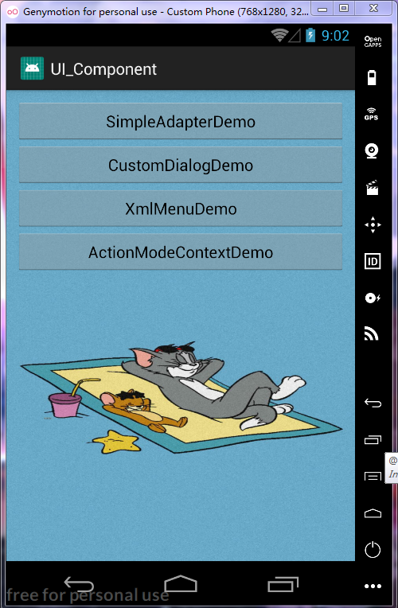
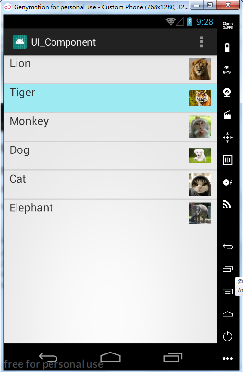
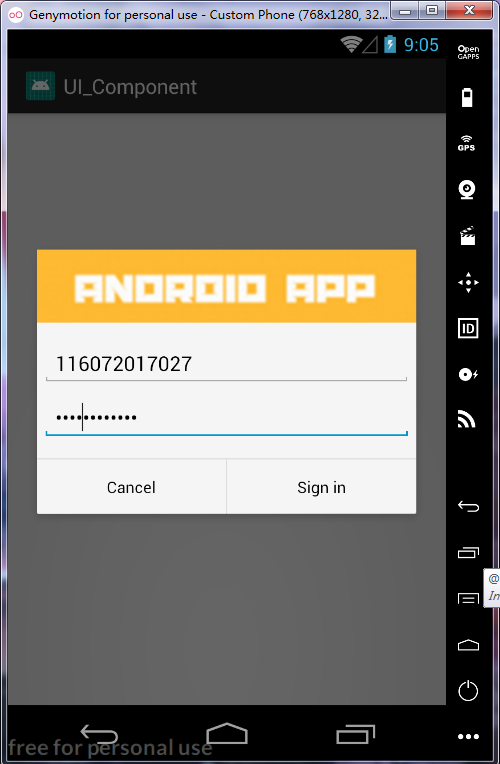
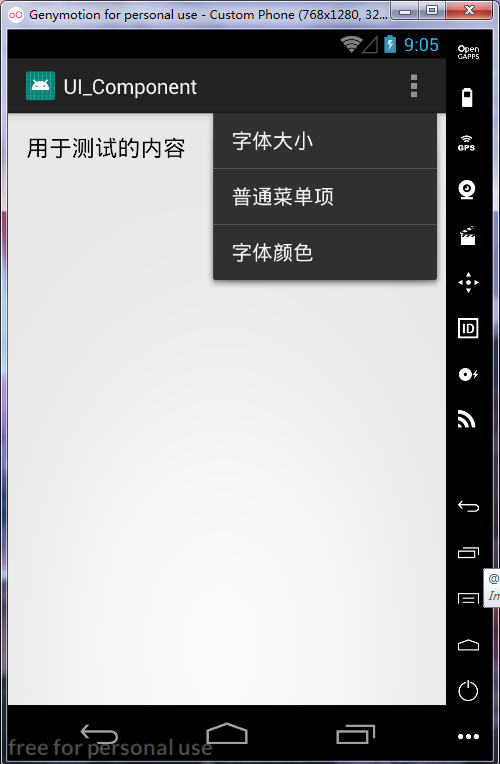
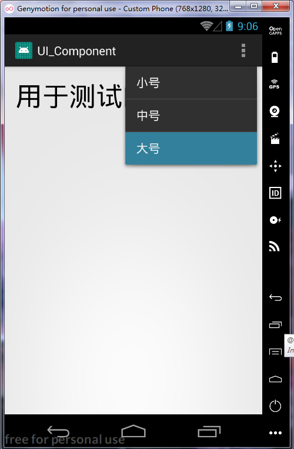
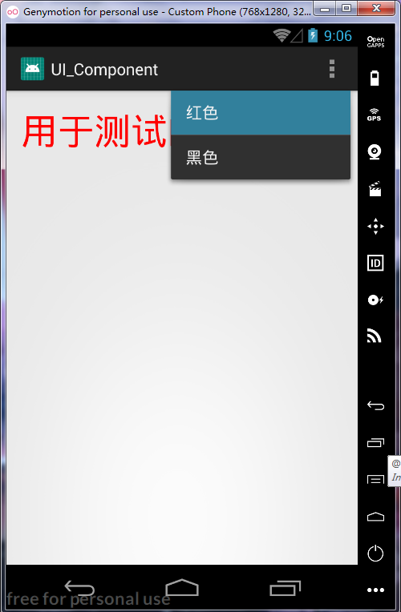
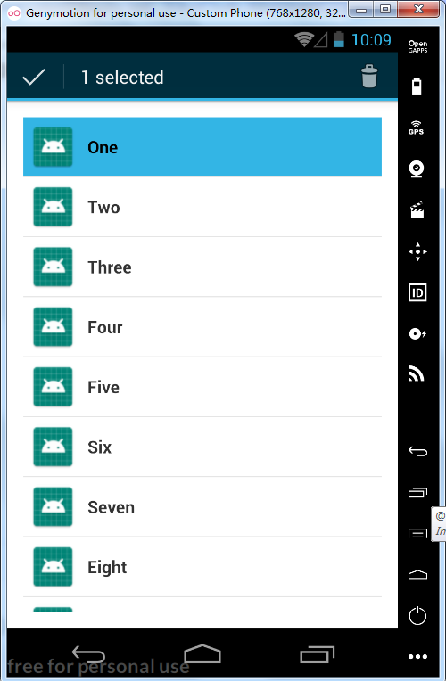
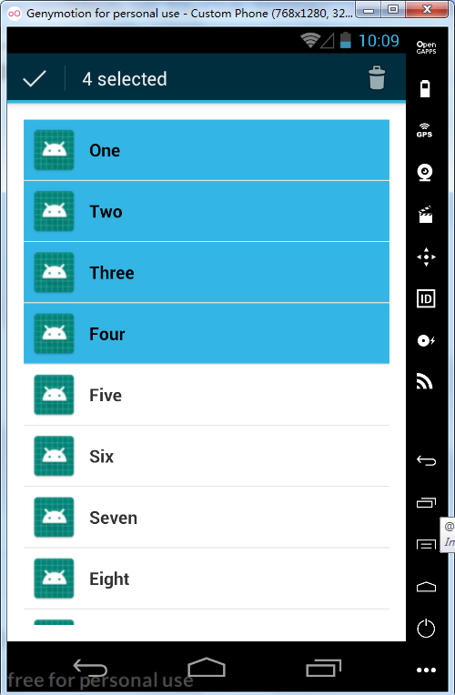
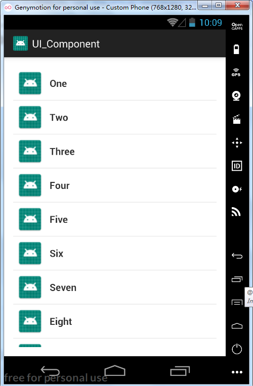

# 实验三：Android UI组件

### 导航界面：

在activity_main.xml中添加四个按钮用以展示实验题目所要求的四个功能

第一个按钮展示ListView效果

第二个按钮展示自定义布局的AlertDialog效果

第三个按钮展示用xml文件定义出来的菜单

第四个按钮展示上下文操作模式ACtionMode 的菜单

##### 效果图如下：



### 一、Android LisrView的用法

在JAVA代码中定义一个HashMap来存放列表数据（动物图片，动物名称）

用SimpleAdapter对ListView进行装配。

ListView每个Item的布局中包含相对布局，其中有一个ImageView和一个TextView。

```
<TextView
            android:id="@+id/textView"
            android:layout_width="wrap_content"
            android:layout_height="wrap_content"
            android:layout_weight="1"
            android:paddingLeft="10dp"
            android:textSize="20sp" />

        <ImageView
            android:id="@+id/imageView"
            android:layout_width="50dp"
            android:layout_height="50dp"
            android:paddingRight="10dp" />
```

listSelector可以实现单击选中ListView中的某项显示颜色

```
<ListView
        android:id="@+id/ListView"
        android:layout_width="match_parent"
        android:layout_height="wrap_content"
        android:dividerHeight="1dp"
        android:listSelector="#9EEAF3"/>
```

##### 效果图如下：



### 二、自定义布局的对话框AlerDialog

在JAVA代码中创建一个AlertDialog. Builder对象

用Builder的setTitle方法和setIcon方法分别设置标题和图片

用setPositiveButton方法和 setNegativeButton方法 设置登录按钮和取消按钮。

用creat方法创建AlertDialog对象，最后调用show方法显示出来

XML中设置普通编辑框和密码编辑框及其他控件的样式：

```
<?xml version="1.0" encoding="utf-8"?>
<LinearLayout xmlns:android="http://schemas.android.com/apk/res/android"
    android:orientation="vertical"
    android:layout_width="wrap_content"
    android:layout_height="wrap_content">

    <ImageView
        android:src="@drawable/header_logo"
        android:layout_width="match_parent"
        android:layout_height="64dp"
        android:scaleType="center"
        android:background="#FFFFBB33"
        android:contentDescription="@string/app_name" />

    <EditText
        android:id="@+id/username"
        android:inputType="textEmailAddress"
        android:layout_width="match_parent"
        android:layout_height="wrap_content"
        android:layout_marginTop="16dp"
        android:layout_marginLeft="4dp"
        android:layout_marginRight="4dp"
        android:layout_marginBottom="4dp"
        android:hint="@string/username" />
    
    <EditText
        android:id="@+id/password"
        android:inputType="textPassword"
        android:layout_width="match_parent"
        android:layout_height="wrap_content"
        android:layout_marginTop="4dp"
        android:layout_marginLeft="4dp"
        android:layout_marginRight="4dp"
        android:layout_marginBottom="16dp"
        android:fontFamily="sans-serif"
        android:hint="@string/password"/>
</LinearLayout>
```

##### 效果图如下：




### 三、xml文件定义菜单

在JAVA代码中重写回调函数onOptionsItemSelected实现相应功能，与onCreate相结合。

xml文件如下：

```
<menu xmlns:android="http://schemas.android.com/apk/res/android">
    <item android:title="@string/menu_Font">
        <menu>
            <item
                android:id="@+id/menu_font_small"
                android:title="@string/menu_font_small"/>
            <item
                android:id="@+id/menu_font_middle"
                android:title="@string/menu_font_middle"/>
            <item
                android:id="@+id/menu_font_big"
                android:title="@string/menu_font_big"/>
        </menu>

    </item>
    <item
        android:id="@+id/menu_normal"
        android:title="@string/menu_Normal">
    </item>
    <item android:title="@string/menu_Color">
        <menu>
            <item
                android:id="@+id/menu_color_red"
                android:title="@string/menu_color_red" />
            <item
                android:id="@+id/menu_color_black"
                android:title="@string/menu_color_black"/>
        </menu>
    </item>
</menu>
```

##### 效果图如下：







## 实验四：创建ActionMode模式的上下文菜单

上下文操作模式是Android3.0以后添加新特性，是上下文菜单的首选模式。

设计基本上分为两种：

- 针对单个任意视图的上下文操作。
- 针对 ListView 或 GridView 中项目组的批处理上下文操作（允许用户选择多个项目并针对所有项目执行操作）。

如果在 ListView 或 GridView 中有一组项目（或 AbsListView 的其他扩展），且需要允许用户执行批处理操作，则应：

- 实现 AbsListView.MultiChoiceModeListener 接口，并使用  setMultiChoiceModeListener()  为视图组设置该接口。在侦听器的回调方法中，您既可以为上下文操作栏指定操作，也可以响应操作项目的点击事件，还可以处理从  ActionMode.Callback 接口继承的其他回调。
- 使用 CHOICE_MODE_MULTIPLE_MODAL 参数调用 setChoiceMode()。

##### 效果图如下：

长按某条记录，即可选中：



继续点击其他记录，可进行多选：



点击右上角的按钮，撤销所有选中的记录：

