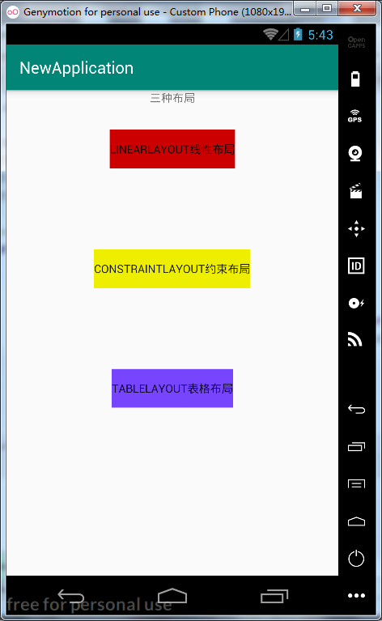
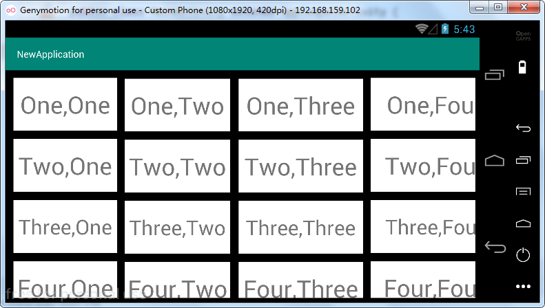
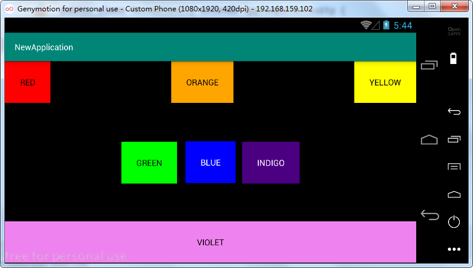
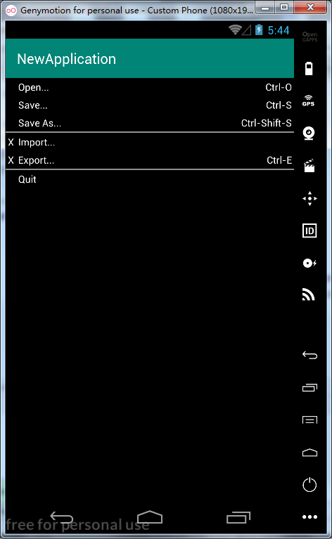

## 主窗口包含三个按钮，Java代码（MainActivity.java）

## 实现响应按钮点击切换界面：

##### 

#### 主界面（activity_main.xml）：

#### 进入线性布局界面（linear_layout.xml）：

#### 进入约束布局界面（constraint_layout.xml）：

#### 进入表格布局界面（table_layout.xml）：

