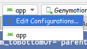
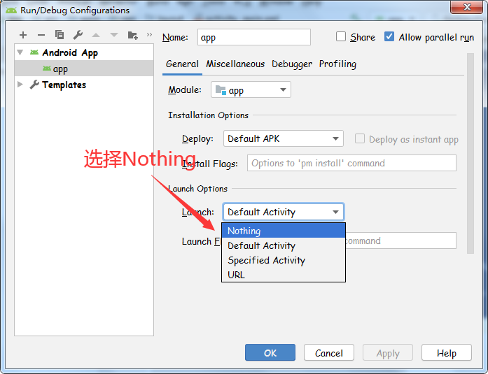
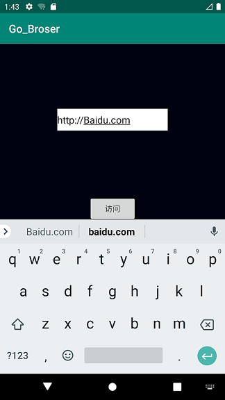
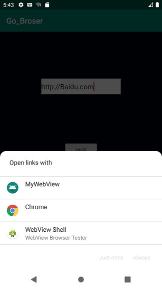
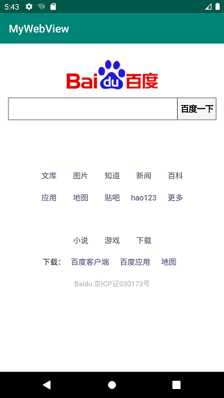

# 实验四：Intent
## 本实验通过自定义WebView加载URL来验证隐式Intent的使用
## 实验包含两个应用：
- 第一个应用：获取URL地址并启动隐式Intent的调用。
- 第二个应用：自定义WebView来加载URL
***
## 工程一：Go_Browser
### 布局文件 activity_main.xml 设定：
### 添加一个编辑框用来输入网址，一个按钮用来跳转至指定网页
```
 <EditText
        android:id="@+id/editText"
        android:layout_width="200dp"
        android:layout_height="40dp"
        android:layout_marginBottom="30dp"
        android:background="@color/colorWhite"
        android:hint="@string/hint_edit"
        android:textSize="20sp"
        app:layout_constraintBottom_toTopOf="@+id/btn_browse"
        app:layout_constraintLeft_toLeftOf="parent"
        app:layout_constraintRight_toRightOf="parent" />
<Button
        android:id="@+id/btn_browse"
        android:layout_width="wrap_content"
        android:layout_height="wrap_content"
        android:background="@color/orange_normal"
        android:useLevel="true"
        android:text="@string/btn_browse"
        android:textColor="#FFFFFF"
        android:textSize="20sp"
        app:layout_constraintBottom_toBottomOf="parent"
        app:layout_constraintLeft_toLeftOf="parent"
        app:layout_constraintRight_toRightOf="parent"
        app:layout_constraintTop_toTopOf="parent" />
```
###  MainActivity.java ：
### 按钮响应事件：获取编辑框中用户输入的URL，实现隐式Intent
```
package com.example.go_browser;

import android.content.Intent;
import android.net.Uri;
import android.os.Bundle;
import android.view.View;
import android.widget.Button;
import android.widget.EditText;
import androidx.appcompat.app.AppCompatActivity;

public class MainActivity extends AppCompatActivity {
    EditText editText;
    Button btn_browse;

    @Override
    protected void onCreate(Bundle savedInstanceState) {
        super.onCreate(savedInstanceState);
        setContentView(R.layout.activity_main);
        editText = (EditText) findViewById(R.id.editText);
        btn_browse = (Button) findViewById(R.id.btn_browse);
        btn_browse.setOnClickListener(new View.OnClickListener() {
            @Override
            public void onClick(View view) {
                String url = editText.getText().toString();
                Intent intent = new Intent();
                intent.setAction(Intent.ACTION_VIEW);
                intent.setData(Uri.parse(url));
                startActivity(intent);
            }
        });
    }
}
```
## 工程二：MyWebView
### 布局文件 activity_main.xml 设定：
### 添加一个WebView组件
```
<WebView
    android:layout_width="match_parent"
    android:layout_height="match_parent"
    android:id="@+id/webView" />
```
### MainActivity.java ：
### 
```
package com.example.mywebview;

import android.content.Intent;
import android.net.Uri;
import android.os.Bundle;
import android.webkit.WebView;
import android.webkit.WebViewClient;
import androidx.appcompat.app.AppCompatActivity;

import java.net.URL;

public class BroserActivity extends AppCompatActivity {

    @Override
    protected void onCreate(Bundle savedInstanceState) {
        super.onCreate(savedInstanceState);
        setContentView(R.layout.activity_main);
        Intent intent = getIntent();
        Uri data = intent.getData();
        URL url = null;
        try {
            url = new URL(data.getScheme(), data.getHost(),
                    data.getPath());
        } catch (Exception e) {
            e.printStackTrace();
        }
        startBrowser(url);
    }

    private void startBrowser(URL url) {
        WebView webView = (WebView) findViewById(R.id.webView);
        //加载web资源
        webView.loadUrl(url.toString());
        //重写webview的setWebViewClient方法，使网页用自定义浏览器打开
        webView.setWebViewClient(new WebViewClient(){
            @Override
            public boolean shouldOverrideUrlLoading(WebView view, String url) {
                view.loadUrl(url);
                return true;
            }
        });
    }
}

```
### AndroidManifest.xml ：
```
<?xml version="1.0" encoding="utf-8"?>
<manifest xmlns:android="http://schemas.android.com/apk/res/android"
    package="com.example.mywebview">

    <uses-permission android:name="android.permission.INTERNET" />

    <application
        android:allowBackup="true"
        android:icon="@mipmap/ic_launcher"
        android:label="@string/app_name"
        android:roundIcon="@mipmap/ic_launcher_round"
        android:supportsRtl="true"
        android:theme="@style/AppTheme"
        android:usesCleartextTraffic="true"
        android:networkSecurityConfig="@xml/network_security_config">

        <activity android:name=".MainActivity">
            <intent-filter>
                <action android:name="android.intent.action.VIEW" />
                <category android:name="android.intent.category.DEFAULT" />
                <category android:name="android.intent.category.BROWSABLE" />
                <data android:scheme="http" />
            </intent-filter>
        </activity>
    </application>

</manifest>
```
### 由于MyBrowser没有指定默认启动的Activity，所以当直接运行时会提示找不到默认Activity的错误，解决方式如下： 




## 最后运行结果如下：




