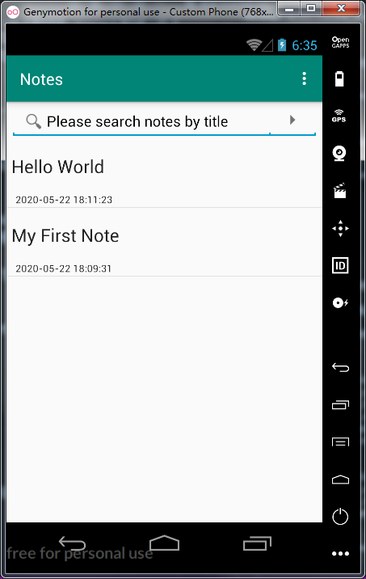
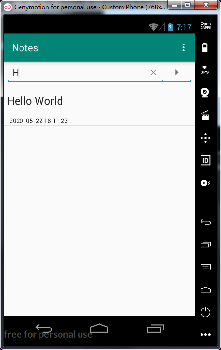
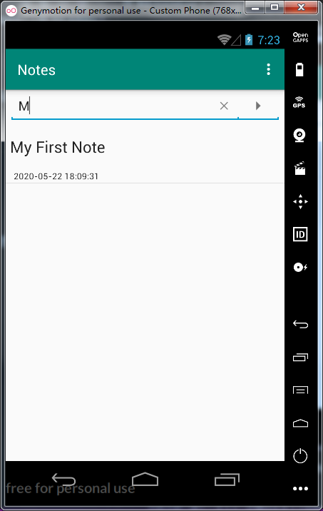
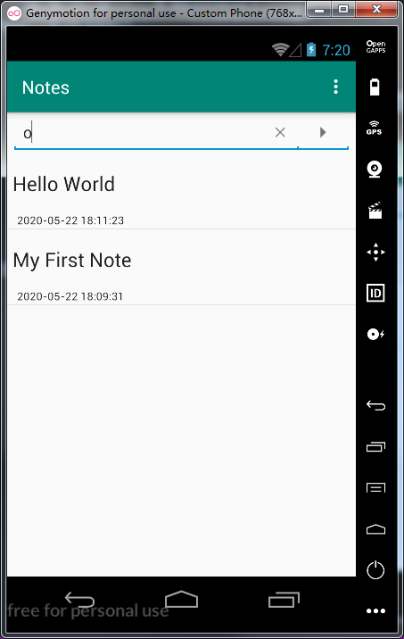

# 期中实验：NotePad 扩展功能

## 1. NoteList中显示条目增加时间戳显示

## 2. 添加笔记查询功能（根据标题查询）

### 扩展功能1代码分析：

（1）首先在noteslist_item.xml布局文件中加入一个TextView来显示时间。注意这里的noteslist_item.xml是用于设置每条笔记项的样式，在NotePad源码中原本只有单个TextView来显示笔记标题，所以在这里要放一个竖向排列的线性布局来容纳住两个TextView：
```
<?xml version="1.0" encoding="utf-8"?>
<LinearLayout xmlns:android="http://schemas.android.com/apk/res/android"
    android:orientation="vertical"
    android:layout_width="match_parent"
    android:layout_height="match_parent"
    android:gravity="center_vertical"
    android:padding="1dp">
<TextView
    android:id="@android:id/text1"
    android:layout_width="match_parent"
    android:layout_height="?android:attr/listPreferredItemHeight"
    android:textAppearance="?android:attr/textAppearanceLarge"
    android:gravity="center_vertical"
    android:paddingLeft="5dip"
    android:singleLine="true"/>
<TextView
    android:id="@android:id/text2"
    android:layout_width="match_parent"
    android:layout_height="match_parent"
    android:textAppearance="?android:attr/textAppearanceLarge"
    android:textSize="12dp"
    android:gravity="center_vertical"
    android:paddingLeft="10dip"
    android:singleLine="true"
    android:layout_weight="1"
    android:layout_margin="0dp" />
</LinearLayout>
```
（2）在NoteEditor.java文件中找到updateNode方法，即每次修改笔记后会调用的这个方法，在其中调用java中提供的Date类及其SimpleDateFormat类来获取当前时间，并格式化为yyyy-MM-dd HH:mm:ss格式：
```
//获取当前时间
Date nowTime = new Date(System.currentTimeMillis());
SimpleDateFormat sdFormatter = new SimpleDateFormat("yyyy-MM-dd HH:mm:ss");
String retStrFormatNowDate = sdFormatter.format(nowTime);
```
调用ContentValues的对象value的put方法，将获取到的这个时间与NotePad.Notes.COLUMN_NAME_MODIFICATION_DATE(也就是sqlite表中 “修改时间” 这个字段)绑定，并存入数据库：
```
ContentValues values = new ContentValues();
values.put(NotePad.Notes.COLUMN_NAME_MODIFICATION_DATE, retStrFormatNowDate);
```
（3）在NotesList.java文件中找到声明的PROJECTION这个String数组，在其中添加一条 “修改时间” 的字段：
```
private static final String[] PROJECTION = new String[] {
    NotePad.Notes._ID, // 0
    NotePad.Notes.COLUMN_NAME_TITLE, // 1
    NotePad.Notes.COLUMN_NAME_MODIFICATION_DATE, //2
};
```
以及dataColumns这个String数组，也添加一条 “修改时间” 的字段：
```
private String[] dataColumns = { NotePad.Notes.COLUMN_NAME_TITLE ,//@@@
                                NotePad.Notes.COLUMN_NAME_MODIFICATION_DATE} ;//@@@
```
还有viewIDs这个int类型数组中，添加用于显示时间的TextView的id值：
```
private int[] viewIDs = { android.R.id.text1 , android.R.id.text2 };//@@@
```
### 效果图如下：



-------------------------------------------------
### 扩展功能2代码分析：
（1）新建一个listview.xml布局文件，用以设置主界面的笔记项列表的样式。在其中放入一个线性布局，在线性布局中放入SearchView组件（即一个搜索框）；还有一个ListView组件，用以显示笔记项列表：
```
<?xml version="1.0" encoding="utf-8"?>
<LinearLayout
    android:layout_width="match_parent"
    android:layout_height="match_parent"
    android:orientation="vertical"
    xmlns:android="http://schemas.android.com/apk/res/android">
    <SearchView
        android:id="@+id/sv"
        android:layout_width="match_parent"
        android:layout_height="wrap_content">
    </SearchView>
    <ListView
        android:id="@+id/tv"
        android:layout_width="match_parent"
        android:layout_height="match_parent"/>
    <ListView>
</LinearLayout>
```
（2）在NotesList.java中声明两个成员变量：一个ListView对象和一个SearchView对象：
```
private ListView listView;//@@@
private SearchView searchView;//@@@
```
（3）对listView进行数据装配：
重写listView的OnItemClick事件方法：
```
adapter = new SimpleCursorAdapter(
        this,                             // The Context for the ListView
        R.layout.noteslist_item,          // Points to the XML for a list item
        cursor,                           // The cursor to get items from
        dataColumns,
        viewIDs,
        CursorAdapter.FLAG_REGISTER_CONTENT_OBSERVER
);//@@@

//--------------------@@@----------------------------------------------@@@-------
listView.setAdapter(adapter);
listView.setOnItemClickListener(new AdapterView.OnItemClickListener() {
    @Override
    public void onItemClick(AdapterView<?> parent, View view, int position, long id) {
        Uri uri = ContentUris.withAppendedId(getIntent().getData(), id);
        String action = getIntent().getAction();
        if (Intent.ACTION_PICK.equals(action) || Intent.ACTION_GET_CONTENT.equals(action)) {
            setResult(RESULT_OK, new Intent().setData(uri));
        } else {
            startActivity(new Intent(Intent.ACTION_EDIT, uri));
        }
    }
});

... ...
```
（4）写一个用于配置searchView的方法：
+ findViewById方法对应上布局文件的SearchView
+ setQueryHint方法设置它的提示文本
+ 重写SearchView类的onQueryTextSubmit方法以及onQueryTextChange方法
+ 新建一个Cursor来通过SeacrhView搜索的字段在数据库中进行模糊搜索从而装配数据，并在ListView中即时显示，无需点击搜索按键
```
private void SearchView(){
    searchView = findViewById(R.id.sv);
    searchView.onActionViewExpanded();
    searchView.setQueryHint("Please search notes by title");
    searchView.setSubmitButtonEnabled(true);
    searchView.setOnQueryTextListener(new SearchView.OnQueryTextListener() {
        @Override
        public boolean onQueryTextSubmit(String s) {
            return false;
        }
        @Override
        public boolean onQueryTextChange(String s) {
            if(!s.equals("")){
                String selection=NotePad.Notes.COLUMN_NAME_TITLE+" GLOB '*"+s+"*'";
                updatecursor = getContentResolver().query(
                        getIntent().getData(), PROJECTION,  selection, null,                          
                        NotePad.Notes.DEFAULT_SORT_ORDER 
                );
                if(updatecursor.moveToNext())
                    Log.i("daawdwad",selection);
            }else {
                updatecursor = getContentResolver().query(
                        getIntent().getData(), PROJECTION,  null,   null,   
                        NotePad.Notes.DEFAULT_SORT_ORDER 
                );
            }
            adapter.swapCursor(updatecursor);
            return false;
        }
    });
}
```
（4）最后在onCreate方法里调用findViewById来让listView对应上布局文件中的ListView，并调用写好的配置searchView的方法。
### 效果图如下：
当搜索框上没有输入时，显示所有的笔记项：


在搜索框上输入一个 “H” ，成功匹配到了标题为 “Hello World” 的笔记项：



在搜索框上输入一个 “M” ，成功匹配到了标题为 “My First Note” 的笔记项：



在搜索框上输入一个 “o” ，标题中包含 “o” 的笔记项都会被匹配到：


